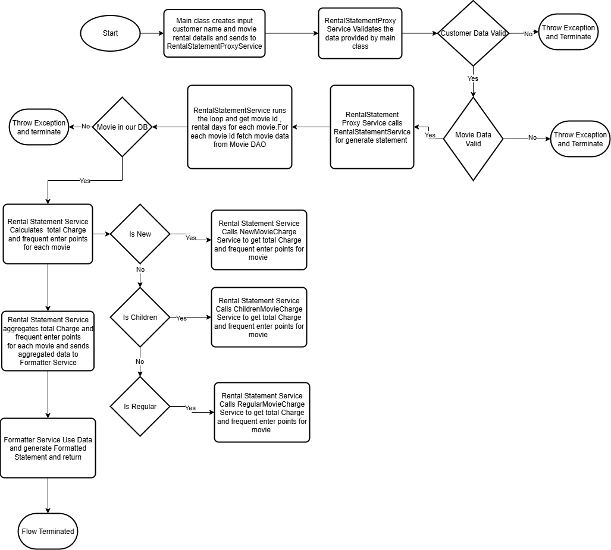
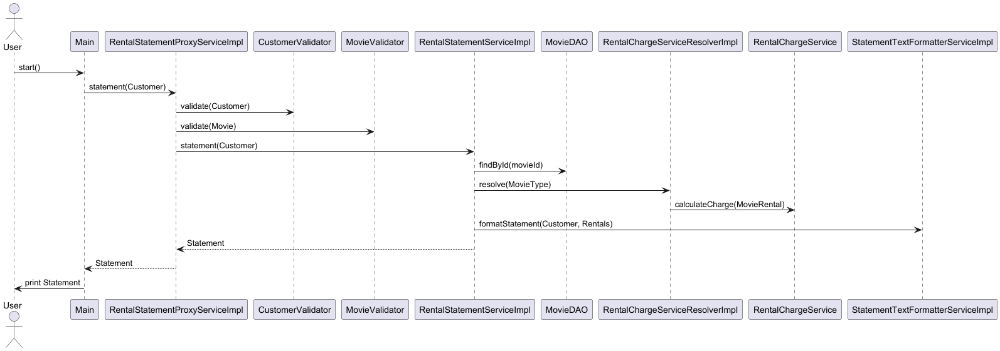

# Refactoring Java

The code creates an information slip about movie rentals.
Rewrite and improve the code after your own liking.

Think: you are responsible for the solution, this is a solution you will have to put your name on.


## Handing in the assignment

Reason how you have been thinking and the decisions you took. 
You can hand in the result any way you feel (git patch, pull-request or ZIP-file).
Note: the Git history must be included.

## Description

This application generates a rental statement for a customer based on the movies they have rented and the duration of the rental.
This application performs following steps
* The application takes customer name,movie ids and corresponding rental days as input
* The application validates input provided by user
* If any inputs are invalid application throws exception and flow is terminated
* If inputs are valid, the application calculates the charge and the frequent enter points for each movie
* The application uses charges and frequent enter points data to generate formatted rental statement

For better understanding of the code flow,we can check the below flow diagram




## Prerequisites
To build and run the application we need to install following software programs
* JDK 21(https://www.oracle.com/se/java/technologies/downloads/#java21)
* Maven 3.9.4(https://maven.apache.org/download.cgi) (I have tested with this maven version,I think It should work with other maven versions also)
* Intellij(https://www.jetbrains.com/idea/download/?section=windows)
* GIT client (Optional)(https://git-scm.com/downloads)

## Before Build And Run
* For build and run the project,you need JDK 21 should be installed and your maven is pointing to JDK 21
* Open command prompt on your machine 
* Check your Java/JDK version using the below command.It should tell version 21
```
   java --version
   ```
* Check your maven version using below command,it will tell you java version maven is pointing
```
   mvn --version
   ```
* If maven java version is not 21,set the JAVA_HOME environment variable,if you want to set it from command prompt temporarily use the below command
```
   set JAVA_HOME="<Path of JDK21>"
   ```
* You can refer to the link https://confluence.atlassian.com/doc/setting-the-java_home-variable-in-windows-8895.html for setting JAVA_HOME environment variable
* Once JAVA_HOME again check and confirm maven is pointing to JDK 21 using above commands.
* If everything is working fine till here,now we can move forward for project setup.

**Note:All the mentioned above steps,I have tried on Windows Machine,similar steps will work for other OS(Linux,Mac) also,which we can search from internet.**

## Download/Checkout the project 
* Open the url https://github.com/vivekdubeydeveloper/movie-rental in web browser
* Click on the code button
* If you are using GIT client,copy https url.
* Open git bash from the folder where you want to check out the project and run the below clone command from GIT bash
```
   git clone https://github.com/vivekdubeydeveloper/movie-rental.git
   ```
* It will download movie-rental project in your folder
* If you are not using git client, when you click on the Code button, you will see the Download Zip menu, click on menu.
* It will download movie-rental-maser.zip file,copy it in appropriate directory.Unzip it, you will get the project in movie-rental-maser folder


## Steps To Build and Run Code From IntelliJ
* Open the project in Intellij.
* Click in Intellij File->Project Structure menu,select SDK 21 in project,module as well as SDK
* Apply the setting.
* Open terminal in the intellij,run the below command it will clean,build and run the test cases(make sure JAVA_HOME is pointing to JDK 21).
   ```
   mvn clean install
   ```
* Jacoco plugin is configured in the pom file so it will generate code coverage html file on the mentioned path <projectfolder>/target/site/jacoco/index.html.Go inside the folder and open the file in any web browser(Chrome,Firefox,IE) to see the test coverage report.
* For running test cases only use the below command
   ```
   mvn test
   ```
* For running test case with report generation, use the below command
   ```
   mvn verify
   ```
* Once build is successful,from the maven panel you can run Sync all the project to sync source code with maven downloaded libs.To check the code,you can run the Main class from Intellij.

## Steps To Build and Run Code without IntelliJ

* Open command prompt 
* Run cd(change directory) command to go inside unzip project folder(movie-rental-master) path.
* You need to verify if JDK,JAVA_HOME and Maven It should be as per above section **Before Build And Run**.
* Run the below command from command prompt,It will clean,build and run the test cases
   ```
   mvn clean install
   ```
* For running the test cases only use the below command
   ```
   mvn test
   ```
* For running test case with report generation
   ```
   mvn verify
   ```  
* For running the code,run the below commands from command prompt(You should go inside the target folder using cd command,jar file should be there if you have run the above maven commands)
   ```
   cd <path to target folder>
   java -cp movie-rental-1.0-SNAPSHOT.jar com.etraveli.movierental.Main
   ```    
  
* We have configured maven-shade-plugin in the pom file so it will generate the fat jar file with all the dependencies so we can run the jar file directly using below command
 ```
   cd <path to target folder>
   java -jar movie-rental-1.0-SNAPSHOT.jar
   ```  
* We can always change the input in main method,after that we can run **mvn clean install** to build the code. We can use above java -jar command to run the code  

## Navigate The Code
* We can navigate the code in Intellij after the maven build.We can open Main class and go inside the main method in Intellij.
* By using Ctr+click we can navigate to the flow in different classes.
* The Flow diagram in description section and below sequence diagram are helpful in for code navigation and understanding
  
* If we want to understand the class structure,we can generate the class diagram from IntelliJ, right-click on the package com.etraveli.movierental,you can see the diagram menu then click on the show diagram submenu. You can see the class digram,then we can select the fields,methods etc. 

## What I Refactored And Why
In this section I have explained what change I have made and why? Why section is describing the current benefits(applicable for this codebase) and future benefits as the codebase scales.

### What:
* Kept classes in packages instead of default package

### Why:
* Packages group related functionality together, which significantly improves code navigation, understanding, and maintenance.
* Packages promote loosely coupled code with high cohesion.
* Packages establish modularity, making the code easily reusable in other projects or modules.
* Package reduce the possibility of Class name conflicts.
* Package helps in SRP on functionality level

#### Package With Description:
com.etraveli.movierental.dao- Keeps database classes
com.etraveli.movierental.exception- Keeps custom exception classes
com.etraveli.movierental.model- Keeps model classes
com.etraveli.movierental.service.user.input- Keeps service classes for user input
com.etraveli.movierental.service.rental.statement- Keeps service classes for rental statement generation
com.etraveli.movierental.service.rental.statement.formatter- Keeps service class for rental statement formatting
com.etraveli.movierental.service.rental.charge- Keeps classes for rental calculation

### What:
* Used maven as build tool

### Why:
* While using javac for compilation and java for execution is feasible for small projects, this manual approach is unsustainable and inefficient for enterprise-scale development.
* Maven is a project management and build automation tool which makes developer life much easier by automating the build process.
* We can compile the code,run the test cases,create artifacts(create jar,war) and run the project.
* We can easily manage the dependencies of 3rd party libraries including transitive dependencies.
* Maven project structure is consistent and clear.
* There are many plugins which can help in different activity for example jacoco plugin helps for code coverage report generation.
* Maven is easy to integrate with CI/CD pipelines.
* There are plugins which can help in 3rd party libs vulnerability detection.
* I have created POM file and added dependencies for **Junit5,log4j2,jacoco plugin and maven shade plugin**. We can check **pom.xml** file.

### What:
* Refactored RentalInfo class

### Why:
* This was kind of god class,which violated the **Single Responsibility Principle (SRP)** by concurrently managing data access (DAO), core business logic (charge calculation), and statement formatting.This was example of bad design.
* Broken this big class in small classes. 
* Created **MovieDAO** class to handle **Data Layer** logic.
* For movie charge and frequent enter point calculation,there are 3 different logics for calculation based on the movie type **(New,Regular,Children)**.This is a very good use case for **Strategy Design Pattern**. **Interface RentalChargeService represent the Strategy with 3 concrete implementations ChildrenMoiveChargeService,NewMoiveChargeService and RegularMoiveChargeService.Moved the calculation logic in appropriate strategy implementation classes.**
* **Implemented RentalChargeServiceResolver interface and implementation class to get appropriate Strategy implementation based on movie type. This is good example of factory with cache or flyweight design pattern.**
* Implemented StatementFormatter service which will generate Formatted rental statement.
* **These classes are following SOLID principle and natural design patterns**
* **These implementations represent the philosophy of loose coupling and high cohesion**
* **These classes are following Interface first philosophy**
* Now the question is what the **RentalInfo** class is doing?This class has been renamed with **RentalStatementServiceImpl (following spring naming convention)**,using above-mentioned classes to fetch calculation result and pass it to statement formatter for formatting.

### What:
* Added RentalStatementProxyService for input validation

### Why:
* There was no class for input validation.Added a proxy class which will help in **input validation**.
* It validates inputs with the help of **MovieValidator and CustomerValidator**,if inputs are invalid throws exception else calls business logic
* Added **ValidationErrors** enum which is central and more maintainable place for error messages
* **Separate crosscutting concerns(input validation) from business logic**
* **Promotes loose coupling,SRP and Open/Close principle**


### What:
* Implemented records for model

### Why:
* Records (Java 17 feature) are immutable data classes.
* Which are very good for keeping immutable data.
* **We do not need to write boilerplate code for getter,setter etc**
* There are 2 enum classes InputType and MovieType which are helpful for model classes
* Instead of keeping movieType as string implemented as enum which is robust and less error-prone

### What:
* Implemented custom exceptions

### Why:
* Implemented custom exceptions which improves readability and clarity.
* Custom exception provides more precise error messages

### What:
* Implemented interactive user input interface

### Why:
* The main class was using hard coded customer data to call the business logic.
* Implemented the class where we can take input from user, now we have 2 options either we can take hard coded input or we can take interactive input from user.
* For switching between the input classes we just need to change input type in main method.
* **Promotes loose coupling,SRP and Open/Close principle**
* **This code is good example of Strategy Design Pattern.**

### What:
* Write unit test cases using junit 5

### Why:
* Testing is one of the important aspect of the code.Using Junit 5 to write the testcases.
* **Test cases covers all the scenario,the code coverage is 100%,which is reflecting in test coverage report generated by Jacoco.**
* Test case helps in early errors detection and understand business flow.
* TDD can be used as good development model

### What:
* Logging using log4j2 framework

### Why:
* Used log4j2 for logging,it will generate log file in application root directory,we can change the log file path form config file log4j2.xml.
* Logging helps in error detection when application is deployed on the Server Machine.
* **Log can be used for variety of the purposes for example how much time each method is taking, how fast DB queries are running?**
* **From the logs we can create monitors**
* Log42 is currently one of the fastest log framework in java

### What:
* Added JavaDoc in code

### Why:
* Added java docs on the classes as well as method level,Which will help in understanding and use the api code
* We can generate HTML document for code
* It will improve the **maintainability** of the code

### Future Improvements
